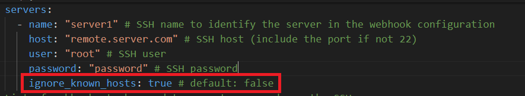
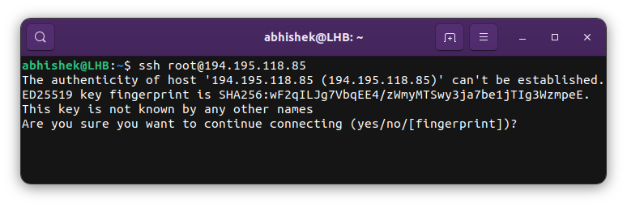
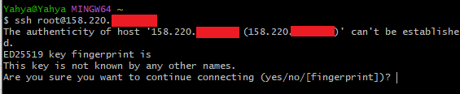

# SSH Webhook

[](https://opensource.org/licenses/MIT)
[](https://github.com/ByPikod/laravel-localization/releases)
[](https://www.yahyabatulu.com/discord)

[](https://github.com/ByPikod/ssh-webhook/stargazers)
[](https://github.com/ByPikod/ssh-webhook/issues)
[](https://github.com/ByPikod/laravel-localization/pulls)

SSH-Webhook is a simple webhook server that can be used to execute commands on a remote server via SSH. It is written in Go and uses **Fiber**.

Sometimes you might need a software to execute commands on a remote server via SSH but the software only supports webhooks. This is where SSH-Webhook comes in. You can use SSH-Webhook to execute commands on a remote server that you will configure via a YAML file. See the [Configuration](#configuration) section for more information.

## Installation

### Docker

```bash
docker run -d \
    -p 8080:8080 \
    -e SSH_WEBHOOK_PORT=8080 \
    -e SSH_WEBHOOK_HOST=
```

### Binaries

## Configuration

SSH-Webhook can be configured via a YAML file. The default path of the YAML file is `ssh-webhook.yaml`. You can change the path by setting the `SSH_WEBHOOK_YAML` environment variable. See the [Environment Variables](#environment-variables) section for more information.

See the [ssh-webhook.example.yaml](ssh-webhook.example.yaml) file for an example configuration.

> [!NOTE]
> The ssh servers will be connected in the order they are defined in the YAML file. If a server is not reachable, the webhook will fail.

> [!TIP]
> There is different ways to authenticate webhooks. But I recommend using this tool locally or in a private network. If you want to use it publicly, at least use it with the ip whitelist. Just token authentication is not secure enough.

### Environment Variables

| Name | Description | Default |
|------|-------------|---------|
| `SSH_WEBHOOK_PORT` | The port that the server will listen on | `8080` |
| `SSH_WEBHOOK_HOST` | The host that the server will listen on | `0.0.0.0` |
| `SSH_WEBHOOK_YAML` | The path to the YAML file that contains the configuration | `ssh-webhook.yaml` |
| `SSH_WEBHOOK_KNOWN_HOSTS` | The path to the known hosts file ([more information](#known-hosts)) | `/home/.ssh/known_hosts` |

### Known Hosts

The known_hosts file stores the public keys of the hosts accessed by a user. This is a very important file that assures that the user is connecting to a legitimate server by saving its identity to your local system. It also helps in avoiding the man-in-the-middle attacks.

**SSH-Webhook uses the known_hosts file to verify the identity of the SSH servers.**

So you will need to add the host keys of the SSH servers to the known_hosts file. Or you can set the `ignore_known_hosts` option to `true` in the YAML file to disable this feature for a specific SSH server. You can add the host key following the guide for [Windows](#adding-host-key-in-windows) or [Linux](#adding-host-key-in-linux).

> [!WARNING]
> Even though you can disable the known_hosts check, I don't recommend it. It is an important security feature.



#### Adding Host Key in Linux

In Linux, the known_hosts file is located at `/home/.ssh/known_hosts`. And this is the default path that SSH-Webhook uses. So only thing you have to do is, adding the host keys to the known_hosts file. Which can be done very easily by trying to login into any SSH server via the SSH Client of your Linux distribution. Command below should work in most Linux distributions:

```bash
ssh user@host
```

Once you try to login, you will be prompted to add the host key to the known_hosts file. Just type `yes` and hit enter. And SSH-Webhook will be able to connect to the SSH server.



#### Adding Host Key in Windows

If you are using Windows, it needs a little bit more work. Because Windows doesn't have a built-in SSH client. So you will need to install one. I recommend using [Git Bash](https://git-scm.com/downloads).

Once you installed the Git Bash, you can open it from Start Menu or by right clicking on a folder and selecting `Git Bash Here`. Then type the following command to login into the SSH server. This will prompt you to the same question as in Linux. Just type `yes` and hit enter.

```bash
ssh user@host
```



## Contributing

All contributions are welcome. Please open an issue first if you want to make major changes.

> [!WARNING]
> Make sure you have appropriate tests for your changes and run the tests before opening a pull request.

### Contributors


## License

This project is licensed under the MIT License - see the [LICENSE](LICENSE) file for details.
